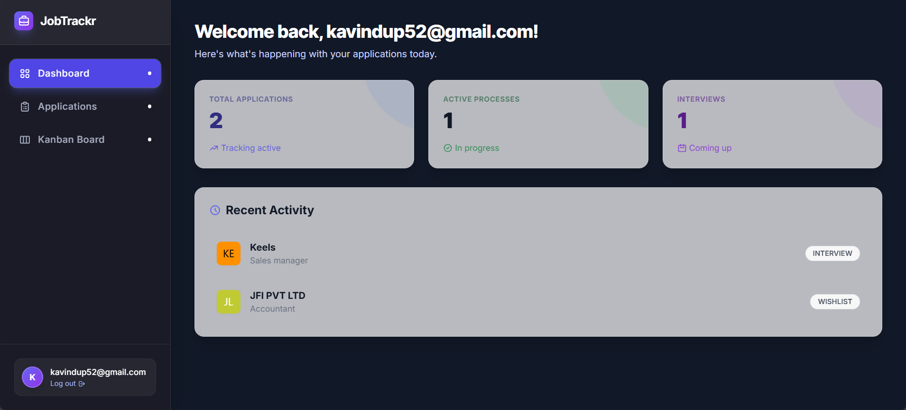

# 🚀 JobTrackr - Premium Job Application Tracker

A modern, high-performance web application designed to help you organize and track your job search with style. Built with **Vanilla JavaScript**, **Vite**, and **Tailwind CSS**, featuring a stunning **Glassmorphism** UI and a robust **Kanban Board**.

🔗 Live demo: https://jobtrackr-peiris.netlify.app


## ✨ Key Features

- **🎨 Premium UI/UX**: 
  - **Glassmorphism Design**: Frosted glass panels, mesh gradients, and `Inter` typography.
  - **Dark Mode**: High-contrast, premium dark theme with abstract backgrounds.
  - **Animated Interactions**: Smooth transitions, hover effects, and interactive elements.

- **📊 Dashboard & Analytics**:
  - Live statistics for Applied, Interviewing, and Offers.
  - "Recent Activity" feed using **Company Logo Avatars**.

- **📋 Kanban Board**:
  - Drag-and-drop workflow management.
  - Move applications seamlessly between *Wishlist*, *Applied*, *Interview*, *Offer*, and *Rejected*.

- **📝 Comprehensive Job Details**:
  - "Cover Page" style layout.
  - **Private Notes**: Timestamped notes for keeping track of interview feedback and thoughts.
  - Status badges and salary tracking.

- **🔒 Privacy First**:
  - **Offline Storage**: Uses **Dexie.js (IndexedDB)** to store all data verify locally in your browser.
  - No external database or login required (Simulation mode with Auth Service).



## 🛠️ Technology Stack

- **Framework**: [Vite](https://vitejs.dev/) (Vanilla JS)
- **Styling**: [Tailwind CSS](https://tailwindcss.com/)
- **Database**: [Dexie.js](https://dexie.org/) (IndexedDB wrapper)
- **Icons**: Heroicons (via SVG)
- **Fonts**: Inter (Google Fonts)

## 🚀 Getting Started

### Prerequisites

- Node.js installed (v14+)

### Installation

1. **Clone the repository** (or download source):
   ```bash
   git clone <repository-url>
   cd job-trackr
   ```

2. **Install dependencies**:
   ```bash
   npm install
   ```

3. **Run Development Server**:
   ```bash
   npm run dev
   ```
   Open `http://localhost:5173` (or the port shown in terminal) to view the app.

4. **Build for Production**:
   ```bash
   npm run build
   ```
   The output will be in the `dist` folder.

## 📂 Project Structure

```
├── src/
│   ├── components/     # UI Components (Layout, JobForm, etc.)
│   ├── pages/          # Page Views (Dashboard, Applications, JobDetails, Board)
│   ├── services/       # Business Logic (Auth, JobService, Dexie DB)
│   ├── router.js       # Client-side Routing Logic
│   ├── main.js         # Entry Point
│   └── style.css       # Global Styles & Tailwind Directives
├── index.html          # Main HTML Template
├── tailwind.config.js  # Tailwind Configuration
└── package.json        # Dependencies & Scripts
```

## 🤝 Contributing

Feel free to fork this project and submit pull requests. Suggestions for new features like "Email Integration" or "Calendar Sync" are welcome!

---

*Built with ❤️ for job seekers everywhere.*
